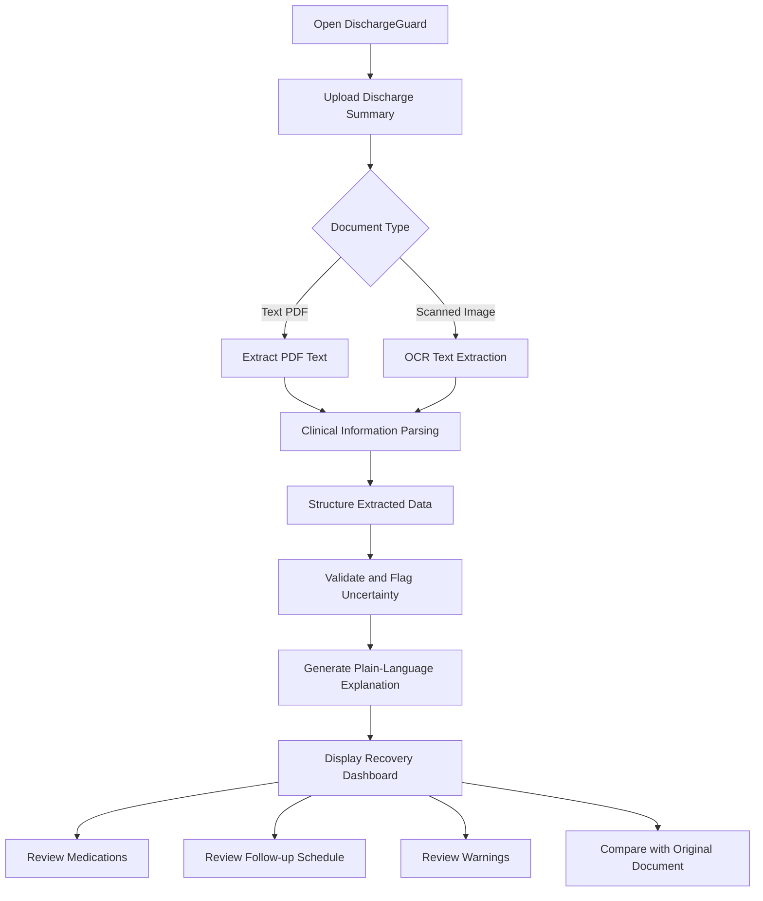

# DischargeGuard

### AI-Powered Hospital Discharge Instructions Simplifier

DischargeGuard is a healthcare-focused application designed to help patients and caregivers understand hospital discharge summaries and surgical discharge documents.

Hospital discharge papers often contain complex medical terminology, medication instructions, and follow-up recommendations that can be difficult to understand. DischargeGuard transforms these documents into clear, structured, easy-to-understand recovery guidance.

Users can upload a hospital discharge summary as a PDF or scanned image and receive an organized explanation of the information contained in the document, including medications, follow-up schedules, and important recovery instructions.

> **Project status:** Healthcare application prototype / hackathon project.

---

## 📌 Table of Contents

* [Overview](#-overview)
* [Problem Statement](#-problem-statement)
* [Our Solution](#-our-solution)
* [Key Features](#-key-features)
* [How It Works](#-how-it-works)
* [Application Workflow](#-application-workflow)
* [Technology Stack](#-technology-stack)
* [System Architecture](#-system-architecture)
* [Project Structure](#-project-structure)
* [Installation and Setup](#-installation-and-setup)
* [API Endpoints](#-api-endpoints)
* [Example Output](#-example-output)
* [Sample Document](#-sample-document)
* [Privacy and Security](#-privacy-and-security)
* [Medical Safety Disclaimer](#-medical-safety-disclaimer)
* [Future Enhancements](#-future-enhancements)
* [Contributing](#-contributing)
* [License](#-license)

---

## 🌟 Overview

DischargeGuard bridges the gap between medical documentation and patient understanding.

The application processes hospital discharge documents and organizes their information into a patient-friendly format without intentionally changing the original clinical instructions.

### Main objectives

* Simplify complex medical language.
* Extract medication names, dosages, and durations from discharge papers.
* Organize follow-up appointments and recovery instructions.
* Highlight important warnings and missing information.
* Help patients and caregivers keep track of post-discharge instructions.

---

## ❗ Problem Statement

Hospital discharge summaries contain important information that patients need to follow after leaving the hospital.

However, patients and caregivers may face difficulties such as:

* Difficulty understanding medical terminology.
* Confusion about medication names, dosages, and schedules.
* Missing or forgetting follow-up appointments.
* Difficulty identifying warning signs mentioned in the document.
* Challenges reading scanned or poorly formatted medical documents.

These challenges can make it harder for patients to follow their discharge instructions correctly.

---

## 💡 Our Solution

DischargeGuard provides a document-based system that converts complex discharge information into a structured, easy-to-read recovery guide.

The user uploads a discharge summary, and the application extracts the available information, organizes it into meaningful sections, and presents a simplified explanation.

### Information provided

1. **Diagnosis summary** — A plain-language explanation of the diagnosis stated in the document.
2. **Medication guide** — Extracted medication names, prescribed dosage, frequency, duration, and instructions.
3. **Follow-up schedule** — Follow-up dates, appointments, and recommendations found in the document.
4. **Recovery instructions** — Rest, hydration, diet, wound care, and other instructions when documented.
5. **Warning signs** — Symptoms or emergency instructions explicitly mentioned in the discharge paper.
6. **Missing information alerts** — Highlights information that is absent, unclear, or requires confirmation.

DischargeGuard is designed to preserve the original medical instructions rather than independently prescribe treatment.

---

## ✨ Key Features

### 📄 1. Discharge Document Upload

* Upload hospital discharge summaries in PDF format.
* Support scanned document images when OCR is available.
* Process text-based clinical documents.
* Display the uploaded document for user reference.

### 🧠 2. Medical Text Extraction

* Extract readable text from discharge documents.
* Identify relevant clinical sections.
* Recognize medication details and follow-up instructions.
* Handle structured and semi-structured document layouts.

### 💊 3. Medication Information

Organize the medication details available in the document:

| Field         | Description                                  |
| ------------- | -------------------------------------------- |
| Medicine name | Extracted medication name                    |
| Dosage        | Prescribed strength or amount                |
| Frequency     | How often it is prescribed                   |
| Duration      | Prescribed number of days or period          |
| Instructions  | Additional directions stated in the document |

The application should flag unclear or incomplete medication information rather than guessing.

### 📅 4. Follow-up Schedule

* Extract follow-up dates and time periods.
* Organize appointments into a readable schedule.
* Display the doctor or department when mentioned.
* Highlight instructions that need confirmation.

### 📝 5. Plain-Language Explanation

Transform complex medical wording into simpler language while retaining the meaning of the original document.

The simplified explanation must not introduce new diagnoses, medications, dosages, or treatment instructions.

### ⚠️ 6. Important Warnings

* Identify warning signs documented by the treating clinician.
* Highlight instructions about when to contact a healthcare professional.
* Flag unclear or potentially conflicting information for review.

### 📋 7. Recovery Action Cards

Organize extracted information into readable cards:

* Medication instructions
* Follow-up appointments
* Recovery recommendations
* Warning signs
* Questions requiring confirmation

### 🔎 8. Source-Based Verification

Where supported, connect extracted information to its source page or document section so users can compare the simplified result with the original discharge paper.

---

## 🔄 How It Works

DischargeGuard follows a document-processing pipeline:

1. **Upload:** The user submits a hospital discharge summary.
2. **Extract:** Text is extracted from the PDF or scanned image.
3. **Parse:** Relevant clinical details are identified.
4. **Structure:** Extracted information is organized into structured fields.
5. **Validate:** Missing, ambiguous, or conflicting information is flagged.
6. **Simplify:** The available information is rewritten in plain language.
7. **Display:** The user receives an organized discharge guidance dashboard.

The original document remains the reference for clinical instructions.

---

## 🖥️ Application Workflow



---

## 🛠️ Technology Stack

The following is the proposed technology stack for the project. Keep only the technologies actually used in your implementation.

| Technology          | Purpose                                         |
| ------------------- | ----------------------------------------------- |
| Python              | Core application logic                          |
| FastAPI             | Backend API development                         |
| Streamlit           | Interactive frontend prototype                  |
| PyMuPDF             | PDF text extraction                             |
| pdfplumber          | PDF text and layout extraction                  |
| Tesseract OCR       | Text extraction from scanned documents          |
| spaCy               | Clinical text processing and entity recognition |
| Regular Expressions | Pattern-based extraction                        |
| Pydantic            | Data validation and structured schemas          |
| SQLite              | Optional local data storage                     |
| LLM                 | Optional controlled plain-language rewriting    |
| pytest              | Automated testing                               |

---

## 🏗️ System Architecture

### Frontend Layer

Responsible for:

* Document upload interface.
* File validation and upload feedback.
* Displaying extracted information.
* Medication and follow-up sections.
* Showing warnings and missing information.

### Backend Layer

Responsible for:

* Receiving uploaded documents.
* Validating file types and size.
* Extracting text from PDFs and images.
* Parsing clinical information.
* Validating extracted fields.
* Generating structured API responses.

### Processing Layer

Responsible for:

* Text cleaning and normalization.
* Clinical section identification.
* Medication and follow-up extraction.
* Identifying missing or ambiguous details.
* Controlled plain-language rewriting.

### Storage Layer

An optional local database can store application metadata and structured results when required.

Sensitive medical documents should not be retained unless the application has an explicit, secure retention policy.

---

## 📂 Project Structure

A suggested project structure:

```text
DischargeGuard/
│
├── backend/
│   ├── main.py
│   ├── api/
│   │   ├── documents.py
│   │   ├── discharge.py
│   │   └── action_cards.py
│   ├── services/
│   │   ├── pdf_extractor.py
│   │   ├── ocr_service.py
│   │   ├── clinical_parser.py
│   │   ├── validation.py
│   │   └── text_simplifier.py
│   ├── models/
│   │   └── schemas.py
│   └── requirements.txt
│
├── frontend/
│   └── app.py
│
├── sample_documents/
│   └── sample_discharge_summary.pdf
│
├── tests/
│   ├── test_extraction.py
│   ├── test_parser.py
│   └── test_validation.py
│
├── .gitignore
├── .env.example
├── LICENSE
└── README.md
```

> This is a reference structure. Update it to reflect the actual folders and files in your GitHub repository.

---

## ⚙️ Installation and Setup

### Prerequisites

* Python 3.10 or later, depending on dependency compatibility.
* pip package manager.
* Git.
* Tesseract OCR, if scanned-image processing is enabled.

### 1. Clone the repository

```bash
git clone https://github.com/Lahari-kotyan/DischargeGuard.git
cd DischargeGuard
```

### 2. Create a virtual environment

**Windows PowerShell:**

```powershell
python -m venv .venv
.venv\Scripts\Activate.ps1
```

If PowerShell blocks activation, use:

```powershell
.venv\Scripts\activate.bat
```

### 3. Install dependencies

If your project has a root-level requirements file:

```bash
pip install -r requirements.txt
```

If dependencies are maintained separately, install them from the relevant backend or frontend requirements file.

### 4. Configure environment variables

If your implementation uses an LLM API or other external services, create a local environment configuration file using the provided example.

Never commit API keys, passwords, or real patient documents to GitHub.

### 5. Run the backend

For a FastAPI application with an entry point at `backend/main.py`:

```bash
uvicorn backend.main:app --reload
```

Open the interactive API documentation at:

http://127.0.0.1:8000/docs

### 6. Run the frontend

For a Streamlit application with an entry point at `frontend/app.py`:

```bash
streamlit run frontend/app.py
```

The exact commands may differ depending on your actual entry-point files.

---

## 🔌 API Endpoints

The following endpoints describe the proposed API design. They are not a claim that every endpoint is already implemented.

| Method | Endpoint                    | Purpose                                   |
| ------ | --------------------------- | ----------------------------------------- |
| GET    | `/health`                   | Check backend health                      |
| POST   | `/api/documents/extract`    | Extract text from a document              |
| POST   | `/api/discharge/analyze`    | Parse and structure discharge information |
| POST   | `/api/discharge/rewrite`    | Generate a plain-language explanation     |
| POST   | `/api/action-card/generate` | Generate structured recovery action cards |
| GET    | `/api/demo/cases`           | Retrieve synthetic demonstration cases    |

### Example workflow

```text
Upload document
↓
POST /api/documents/extract
↓
POST /api/discharge/analyze
↓
POST /api/discharge/rewrite
↓
POST /api/action-card/generate
↓
Display results
```

---

## 📄 Example Output

The following is an illustrative example using fictional patient information.

### Discharge Summary Overview

| Field               | Example                           |
| ------------------- | --------------------------------- |
| Diagnosis           | Acute gastroenteritis             |
| Discharge condition | Stable, as documented             |
| Follow-up           | Review with a physician in 5 days |

### Medication Information

| Medication         | Instructions extracted                             |
| ------------------ | -------------------------------------------------- |
| Paracetamol 500 mg | One tablet, three times daily for 3 days, if fever |
| Pantoprazole 40 mg | One tablet daily before breakfast for 5 days       |
| Probiotic capsule  | One capsule twice daily for 5 days                 |
| ORS                | As needed, especially after loose stools           |

### Follow-up and Recovery Guidance

* Review with the physician after 5 days.
* Maintain hydration and follow the documented ORS instructions.
* Follow the dietary advice provided by the treating clinician.
* Seek medical attention according to the warning signs specified in the discharge document.

> Example data is for demonstration only. It is not a prescription or a recommendation for an actual patient.

---

## 🧪 Sample Document

A sample discharge summary can be used to demonstrate the upload and extraction workflow.

The sample should contain fictional patient details and clearly labeled demonstration data.

Suggested document fields:

* Hospital name
* Patient information
* Admission and discharge dates
* Final diagnosis
* Presenting complaints
* Investigations
* Treatment provided
* Discharge medications
* Follow-up instructions
* Doctor's notes

Do not use real patient documents in public demonstrations without appropriate authorization and privacy safeguards.

---

## 🔐 Privacy and Security

Medical documents can contain highly sensitive personal information. DischargeGuard should be designed with privacy and security in mind.

Recommended safeguards:

* Validate uploaded file types and sizes.
* Avoid storing uploaded documents unnecessarily.
* Use secure handling of temporary files.
* Avoid logging patient names, diagnoses, or medication details.
* Protect API endpoints against unauthorized access.
* Keep API keys and credentials out of source control.
* Provide clear information about data retention and deletion.
* Use synthetic data for public demos and automated tests.

These safeguards must be implemented and verified before the application is used with real patient data.

---

## ⚕️ Medical Safety Disclaimer

DischargeGuard is an informational software prototype intended to help users understand the information contained in hospital discharge documents.

It is **not a substitute for professional medical advice, diagnosis, or treatment.**

* The application must not independently prescribe or change medication.
* Extracted information may contain errors or omissions.
* Unclear, conflicting, or incomplete instructions must be verified with the treating healthcare professional.
* Patients should follow the instructions provided by their healthcare team.
* For urgent or emergency symptoms, seek appropriate medical care rather than relying on the application.

The original discharge document and the treating clinician remain the authoritative sources for patient-specific medical instructions.

---

## 🚀 Future Enhancements

Potential improvements include:

* Multilingual discharge explanations.
* Support for additional document formats.
* Improved OCR for low-quality scanned documents.
* Medication schedule visualization.
* Follow-up appointment reminders.
* Downloadable recovery summaries.
* Source-page references for extracted information.
* Improved detection of missing and conflicting instructions.
* Accessibility features for elderly users and caregivers.
* Secure patient accounts and document management.
* Automated testing with synthetic clinical documents.
* Evaluation of extraction accuracy and plain-language fidelity.

---

## 📊 Evaluation Metrics

The project can be evaluated using measurable outcomes such as:

| Metric                        | What it measures                                     |
| ----------------------------- | ---------------------------------------------------- |
| Extraction accuracy           | Correctness of extracted document fields             |
| Medication field accuracy     | Correct extraction of medication details             |
| Follow-up extraction accuracy | Correct identification of dates and instructions     |
| Unsupported information rate  | Frequency of information not present in the source   |
| Processing time               | Time taken to analyze a document                     |
| User comprehension            | Whether users understand the simplified instructions |
| Missing-information detection | Ability to flag incomplete or ambiguous details      |

Evaluation should use appropriately reviewed, synthetic, or authorized data.

---

## 🤝 Contributing

Contributions are welcome!

1. Fork the repository.
2. Create a feature branch.
3. Make your changes.
4. Add or update tests where appropriate.
5. Submit a pull request describing your changes.

Please do not contribute real patient records, personal health information, or API credentials.

---

## 📜 License

This project is intended for educational and development purposes.

Choose an appropriate open-source license before distributing the project. If you select the MIT License, include a corresponding `LICENSE` file in the repository.

---

## 👩‍💻 Author

**Lahari Kotian**

Artificial Intelligence and Machine Learning Engineering Student

GitHub: [Lahari-kotyan](https://github.com/Lahari-kotyan)

---

## ❤️ Acknowledgment

DischargeGuard is developed as a healthcare technology project focused on making medical discharge information easier to understand and helping patients and caregivers navigate post-hospital care instructions.

**Making medical information easier to understand, one discharge summary at a time.**
