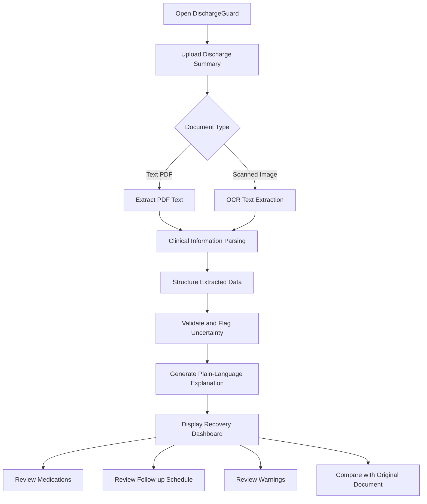

<div align="center">

# 🏥 DischargeGuard

### AI-Powered Hospital Discharge Instructions Simplifier

**Turning confusing discharge paperwork into clear, structured recovery guidance — without changing a single clinical instruction.**


[Overview](#-overview) • [Problem](#-problem-statement) • [Solution](#-our-solution) • [Features](#-key-features) • [Architecture](#-system-architecture) • [Setup](#️-installation-and-setup) • [Demo](#-example-output) • [Safety](#️-medical-safety-disclaimer)

</div>

---

## 🌟 Overview

Every year, millions of patients walk out of hospitals holding a discharge summary they barely understand — dense medical shorthand, ambiguous dosing instructions, and follow-up dates buried in a wall of clinical text.

**DischargeGuard** closes that gap. Upload a discharge summary (PDF or scanned image), and it returns an organized, plain-language recovery guide — medications, follow-ups, warning signs, and open questions — all traceable back to the original document.

> **No new diagnoses. No new medications. No invented dosages.** DischargeGuard organizes and simplifies what the clinician already wrote — it never adds to it.

### Main objectives

* Simplify complex medical language into something a patient or caregiver can actually act on.
* Extract medication names, dosages, and durations directly from the source document.
* Organize follow-up appointments and recovery instructions into a schedule.
* Surface warnings and flag missing or ambiguous information instead of guessing.
* Give caregivers a single, trustworthy place to track post-discharge care.

---

## ❗ Problem Statement

Discharge summaries are often the *only* document a patient takes home — and they're rarely written for patients.

* Dense medical terminology obscures the actual diagnosis and plan.
* Medication names, dosages, and schedules get confused or missed entirely.
* Follow-up appointments are forgotten or misread.
* Warning signs that should trigger a call to a doctor go unnoticed.
* Scanned or poorly formatted documents are hard for anyone to read closely.

The result: preventable readmissions, missed follow-ups, and medication errors — all traceable to a communication gap DischargeGuard is built to close.

---

## 💡 Our Solution

DischargeGuard is a **document-grounded** system: it reads what's in the discharge summary, structures it, and rewrites it in plain language — nothing more, nothing less.

| # | Output                       | What it contains                                                        |
| - | ----------------------------- | ------------------------------------------------------------------------ |
| 1 | **Diagnosis summary**         | Plain-language explanation of the stated diagnosis                       |
| 2 | **Medication guide**          | Name, dosage, frequency, duration, and instructions, as documented       |
| 3 | **Follow-up schedule**        | Dates, appointments, and provider/department, as documented              |
| 4 | **Recovery instructions**     | Rest, hydration, diet, wound care — only when explicitly stated          |
| 5 | **Warning signs**              | Symptoms and emergency instructions exactly as the clinician wrote them   |
| 6 | **Missing information alerts** | Flags on anything absent, unclear, or requiring confirmation             |

---

## ✨ Key Features

### 📄 1. Discharge Document Upload
- Upload PDF discharge summaries directly.
- Support scanned document images via OCR.
- Process structured or semi-structured clinical text.
- View the original document alongside extracted results.

### 🧠 2. Medical Text Extraction
- Extract clean, readable text from PDFs and scans.
- Identify relevant clinical sections automatically.
- Recognize medication and follow-up patterns.
- Handle both structured and messy real-world layouts.

### 💊 3. Medication Information

| Field         | Description                                  |
| ------------- | --------------------------------------------- |
| Medicine name | Extracted medication name                    |
| Dosage        | Prescribed strength or amount                |
| Frequency     | How often it is prescribed                   |
| Duration      | Prescribed number of days or period          |
| Instructions  | Additional directions stated in the document |

Unclear or incomplete medication entries are **flagged, never guessed.**

### 📅 4. Follow-up Schedule
- Extracts follow-up dates and time windows.
- Organizes appointments into a readable schedule.
- Displays the responsible doctor or department, when mentioned.
- Flags anything ambiguous for user confirmation.

### 📝 5. Plain-Language Explanation
Rewrites clinical language into everyday terms while strictly preserving meaning. The rewrite layer is **constrained**: it cannot introduce new diagnoses, medications, dosages, or instructions.

### ⚠️ 6. Important Warnings
- Surfaces warning signs exactly as documented by the treating clinician.
- Highlights when-to-call-a-doctor instructions.
- Flags unclear or conflicting information for review.

### 📋 7. Recovery Action Cards
Everything organized into scannable cards: medications, follow-ups, recovery steps, warnings, and open questions.

### 🔎 8. Source-Based Verification
Where supported, every extracted field links back to its source page or section — so the patient can always check the simplified card against the original document.

---

## 🔄 How It Works

1. **Upload** — the user submits a discharge summary.
2. **Extract** — text is pulled from the PDF or scanned image.
3. **Parse** — clinical details are identified and isolated.
4. **Structure** — extracted information is organized into fields.
5. **Validate** — missing, ambiguous, or conflicting details are flagged.
6. **Simplify** — the available information is rewritten in plain language.
7. **Display** — the user gets an organized recovery dashboard.

The original document always remains the authoritative reference.



---

## 🛠️ Technology Stack

> Keep only what your implementation actually uses.

| Technology           | Purpose                                          |
| -------------------- | ------------------------------------------------- |
| Python               | Core application logic                            |
| FastAPI              | Backend API development                           |
| Streamlit            | Interactive frontend prototype                    |
| PyMuPDF              | PDF text extraction                               |
| pdfplumber           | PDF text and layout extraction                    |
| Tesseract OCR        | Text extraction from scanned documents            |
| spaCy                | Clinical text processing and entity recognition   |
| Regular Expressions  | Pattern-based extraction                          |
| Pydantic             | Data validation and structured schemas            |
| SQLite               | Optional local data storage                       |
| LLM                  | Optional, controlled plain-language rewriting     |
| pytest               | Automated testing                                 |

---

## 🏗️ System Architecture

**Frontend Layer** — upload UI, file validation, medication/follow-up displays, warnings and missing-info surfaces.

**Backend Layer** — receives documents, validates file type/size, extracts text, parses clinical fields, validates results, serves structured API responses.

**Processing Layer** — text cleaning and normalization, section identification, medication/follow-up extraction, ambiguity detection, controlled plain-language rewriting.

**Storage Layer** — optional local database for metadata and structured results. Sensitive documents are not retained without an explicit, secure retention policy.

---

## 📂 Project Structure

```text
DischargeGuard/
│
├── backend/
│   ├── main.py
│   ├── api/
│   │   ├── documents.py
│   │   ├── discharge.py
│   │   └── action_cards.py
│   ├── services/
│   │   ├── pdf_extractor.py
│   │   ├── ocr_service.py
│   │   ├── clinical_parser.py
│   │   ├── validation.py
│   │   └── text_simplifier.py
│   ├── models/
│   │   └── schemas.py
│   └── requirements.txt
│
├── frontend/
│   └── app.py
│
├── sample_documents/
│   └── sample_discharge_summary.pdf
│
├── tests/
│   ├── test_extraction.py
│   ├── test_parser.py
│   └── test_validation.py
│
├── .gitignore
├── .env.example
├── LICENSE
└── README.md
```

> Reference structure — update to match your actual repository.

---

## ⚙️ Installation and Setup

### Prerequisites
- Python 3.10+
- pip
- Git
- Tesseract OCR (only if scanned-image processing is enabled)

### 1. Clone the repository
```bash
git clone https://github.com/Lahari-kotyan/DischargeGuard.git
cd DischargeGuard
```

### 2. Create a virtual environment

**Windows PowerShell:**
```powershell
python -m venv .venv
.venv\Scripts\Activate.ps1
```
If PowerShell blocks activation:
```powershell
.venv\Scripts\activate.bat
```

**macOS / Linux:**
```bash
python3 -m venv .venv
source .venv/bin/activate
```

### 3. Install dependencies
```bash
pip install -r requirements.txt
```
Or, if dependencies are split, install from the relevant backend/frontend requirements file.

### 4. Configure environment variables
Copy `.env.example` to `.env` and fill in any keys needed for LLM or external services.
**Never commit API keys, passwords, or real patient documents.**

### 5. Run the backend
```bash
uvicorn backend.main:app --reload
```
Interactive docs: `http://127.0.0.1:8000/docs`

### 6. Run the frontend
```bash
streamlit run frontend/app.py
```

---

## 🔌 API Endpoints

| Method | Endpoint                     | Purpose                                     |
| ------ | ----------------------------- | -------------------------------------------- |
| GET    | `/health`                     | Check backend health                         |
| POST   | `/api/documents/extract`      | Extract text from a document                 |
| POST   | `/api/discharge/analyze`      | Parse and structure discharge information    |
| POST   | `/api/discharge/rewrite`      | Generate a plain-language explanation        |
| POST   | `/api/action-card/generate`   | Generate structured recovery action cards    |
| GET    | `/api/demo/cases`             | Retrieve synthetic demonstration cases       |

```text
Upload document
  ↓
POST /api/documents/extract
  ↓
POST /api/discharge/analyze
  ↓
POST /api/discharge/rewrite
  ↓
POST /api/action-card/generate
  ↓
Display results
```

---

## 📄 Example Output

*Illustrative example using fictional patient information.*

**Discharge Summary Overview**

| Field               | Example                            |
| -------------------- | ------------------------------------ |
| Diagnosis            | Acute gastroenteritis               |
| Discharge condition  | Stable, as documented                |
| Follow-up            | Review with a physician in 5 days   |

**Medication Information**

| Medication          | Instructions extracted                              |
| -------------------- | ------------------------------------------------------ |
| Paracetamol 500 mg   | One tablet, three times daily for 3 days, if fever    |
| Pantoprazole 40 mg   | One tablet daily before breakfast for 5 days          |
| Probiotic capsule    | One capsule twice daily for 5 days                    |
| ORS                  | As needed, especially after loose stools              |

**Follow-up and Recovery Guidance**
- Review with the physician after 5 days.
- Maintain hydration and follow the documented ORS instructions.
- Follow the dietary advice provided by the treating clinician.
- Seek medical attention according to the warning signs specified in the discharge document.

> Example data is for demonstration only — not a prescription or recommendation for any real patient.

---

## 🧪 Sample Document

A sample discharge summary demonstrates the upload → extraction workflow. It should contain fictional patient details, clearly labeled as demonstration data:

Hospital name • Patient information • Admission/discharge dates • Final diagnosis • Presenting complaints • Investigations • Treatment provided • Discharge medications • Follow-up instructions • Doctor's notes

**Never use real patient documents in public demos without proper authorization and safeguards.**

---

## 🔐 Privacy and Security

Medical documents carry highly sensitive personal information. Recommended safeguards:

- Validate uploaded file types and sizes.
- Avoid storing uploaded documents unnecessarily.
- Use secure handling of temporary files.
- Avoid logging patient names, diagnoses, or medication details.
- Protect API endpoints against unauthorized access.
- Keep API keys and credentials out of source control.
- Provide clear data retention and deletion policies.
- Use synthetic data for public demos and automated tests.

**These safeguards must be implemented and verified before using real patient data.**

---

## ⚕️ Medical Safety Disclaimer

DischargeGuard is an informational software prototype that helps users understand the contents of hospital discharge documents. It is **not a substitute for professional medical advice, diagnosis, or treatment.**

- The application must not independently prescribe or change medication.
- Extracted information may contain errors or omissions.
- Unclear, conflicting, or incomplete instructions must be verified with the treating healthcare professional.
- Patients should follow the instructions provided by their healthcare team.
- For urgent or emergency symptoms, seek appropriate medical care rather than relying on the application.

The original discharge document and the treating clinician remain the authoritative sources for patient-specific medical instructions.

---

## 📊 Evaluation Metrics

| Metric                          | What it measures                                      |
| --------------------------------- | -------------------------------------------------------- |
| Extraction accuracy              | Correctness of extracted document fields                |
| Medication field accuracy        | Correct extraction of medication details                 |
| Follow-up extraction accuracy    | Correct identification of dates and instructions          |
| Unsupported information rate     | Frequency of information not present in the source        |
| Processing time                  | Time taken to analyze a document                          |
| User comprehension               | Whether users understand the simplified instructions      |
| Missing-information detection    | Ability to flag incomplete or ambiguous details            |

Evaluation should always use appropriately reviewed, synthetic, or authorized data.

---

## 🚀 Future Enhancements

- Multilingual discharge explanations
- Support for additional document formats
- Improved OCR for low-quality scans
- Medication schedule visualization
- Follow-up appointment reminders
- Downloadable recovery summaries
- Source-page references for every extracted field
- Better detection of missing and conflicting instructions
- Accessibility features for elderly users and caregivers
- Secure patient accounts and document management
- Automated testing with synthetic clinical documents
- Formal evaluation of extraction accuracy and plain-language fidelity

---

## 🤝 Contributing

1. Fork the repository.
2. Create a feature branch.
3. Make your changes.
4. Add or update tests where appropriate.
5. Submit a pull request describing your changes.

Please do not contribute real patient records, personal health information, or API credentials.

---

## 📜 License

This project is intended for educational and development purposes. Choose an appropriate open-source license before distributing it — the badge above assumes MIT; include a matching `LICENSE` file if so.

---

<div align="center">

## 👩‍💻 Author

**Lahari Kotian**
Artificial Intelligence and Machine Learning Engineering Student
GitHub: [@Lahari-kotyan](https://github.com/Lahari-kotyan)

---

### ❤️ Making medical information easier to understand, one discharge summary at a time.

</div>
